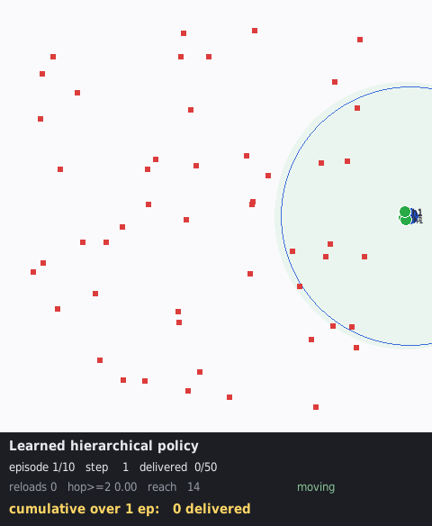

# Relay Drone Network — 재난 물자 배송을 위한 계층형 MARL

재난으로 통신 인프라가 파괴된 지역에서, 드론 편대가 물자를 배송하면서 동시에 서로의 통신을
중계하여 **모든 기체가 제어 센터와 항시 연결된 상태**를 유지하는 문제를 다룬다.
목적함수는 전 목적지 배송 완료 시간(makespan)의 최소화다.

- 프레임워크 설명: [`docs/framework_v3_26_08_31_19.md`](docs/framework_v3_26_08_31_19.md)
- 버전 간 차이 이력: [`docs/VERSIONS.md`](docs/VERSIONS.md)
- 논문 초안: [`docs/tex/`](docs/tex/) (국문·영문)
- 문헌 검토: [`ref/marl-relay-drone-delivery.md`](ref/marl-relay-drone-delivery.md)

## 문제 설정

| 항목 | 값 |
|---|---|
| 드론 / 목적지 | 4대 / 50곳 |
| 지도 | 1000 × 1000 |
| 통신 반경 | 300 |
| 적재량 / 하역 시간 | 5 / 10 스텝 |
| 최대 속도 | 13.89 / 스텝 |
| 에피소드 상한 | 1000 스텝 |

통신 반경 300은 임의로 고른 값이 아니다. 난이도 스윕 결과 반경 400 이상에서는 탐욕 휴리스틱이
문제를 사실상 해결해 학습이 기여할 여지가 없고, 300에서 (a) 탐욕이 실패하기 시작하며
(b) 인스턴스마다 최적 중계 대수가 달라 고정 규칙이 원리적으로 최적일 수 없다.

## 구조

```
proposed_src/
  env/       재난 릴레이 드론 환경 (연결성 하드 제약, 지표 계측)
  model/     정책·가치 네트워크
  pipeline/  학습 루프, 베이스라인, 평가, 감시 스크립트
  util/      인스턴스 생성, 상태 요약, 시각화, 난이도 스윕
docs/        프레임워크 설명, 버전 이력, 실험 보고, 논문 초안
ref/         문헌 검토
figures/     그래프, 시뮬레이션 GIF, 평가 결과 CSV
runs/        학습 로그 (지표 CSV)
weights/     각 실행의 최적 정책
legacy/      더 이상 쓰지 않으나 보존하는 코드 (MILP 시도, v1 이전 원본)
```

파일명 접미는 `버전넘버_YY_MM_DD_HH` 형식이다.

## 실행

```bash
# 계층 학습 — 1단계: 상위를 규칙으로 고정하고 하위(추력)만 학습
python3 proposed_src/pipeline/train_v3_26_08_31_19.py \
    --tag v3_w --stage worker --comm-range 300 --no-cluster-penalty

# 2단계: 하위를 고정하고 상위(이산 할당)만 학습
python3 proposed_src/pipeline/train_v3_26_08_31_19.py \
    --tag v3_m --stage manager --comm-range 300 --no-cluster-penalty \
    --worker-ckpt weights/v3_26_08_31_19_w_nocl/best_worker.pth

# 베이스라인 대비 평가 (홀드아웃 30 인스턴스 × 3회)
python3 proposed_src/pipeline/eval_v3_26_08_31_19.py --n 30 --reps 3 --no-cluster-penalty \
    --worker weights/v3_26_08_31_19_m_hl20/best_worker.pth \
    --manager weights/v3_26_08_31_19_m_hl20/best_manager.pth

# 학습 상태 요약
python3 proposed_src/util/status_v2_26_08_25_14.py

# 시각화 (탐욕 대 제안, 좌우 비교 GIF)
python3 proposed_src/util/compare_viz_v2_26_08_25_14.py --seed 101
```

크래시 시 자동 재개가 필요하면 `proposed_src/pipeline/supervise_v3_26_08_31_19.sh`로 감싼다.

## 현재 결과

홀드아웃 20 인스턴스, 여유 예산(상한 10,000스텝, 조기 종료 없음), 확률 샘플링 추론.

| 방법 | 배송 | 완주 | makespan | 최장교착 |
|---|---|---|---|---|
| 탐욕 | 23.3 | 0% | — | 9,745 |
| 중계 2대 고정 | 35.4 | 3% | 943 | 4,676 |
| **기하 중계 규칙 (학습 없음)** | **47.4** | **17/20** | **825** | 중앙값 14 |
| **제안 (계층 MARL + 중계 행동)** | **48.2** | 4.7/20 | 2,815 | **64** |

**중계 지점 선택 행동이 이 문제의 핵심이다.** 같은 가중치로 평가 시 중계 열만 닫으면
배송이 48.2 → 40.2로 떨어지고 최장 교착이 64 → 2,595로 **41배** 늘어난다.
중계 슬롯으로 이동하는 움직임이 얽힌 편대를 푸는 탈출구 역할을 한다.

다만 **그 효과는 학습으로 얻은 것이 아니다.** 중계를 한 번도 학습하지 않은 정책이
평가에서 중계를 쓸 수 있게 하면 48.70으로 오히려 가장 높다. 행동 공간에 존재하는
것만으로 값을 한다.

**무학습 기하 규칙이 완주와 makespan에서 여전히 앞선다**(17/20, 825 대 4.7/20, 2,815).
이 규칙은 이봉 분포로, 17건은 최장교착 중앙값 14로 막히지 않고 3건은 9,523스텝을
갇혀 있다 — 결정론적이라 교착에서 같은 배정을 반복하기 때문이다.

**저수준 학습은 해롭다.** 학습된 하위를 직진 제어로 바꾸면 완주가 0-2%에서 14-38%로
오른다. 상위가 좋은 경유점을 주면 직진으로 충분하다.

자세한 절제 결과와 규명 과정은 [`docs/VERSIONS.md`](docs/VERSIONS.md)를 참조한다.



## 저장소에 포함하지 않은 것

- 에피소드별 체크포인트 약 3,300개(1GB) — 각 실행의 `best_*.pth`와 논문에 인용된
  v1 체크포인트 2개만 포함한다
- TensorBoard 이벤트 파일(187MB) — 동일 지표가 `runs/<tag>/metrics_<tag>.csv`에 있다

## 환경

Python 3.10, PyTorch 2.10 (CUDA 12.8), NumPy, Matplotlib, pygame, TensorBoard.
MILP 레거시 코드는 gurobipy가 필요하다.
