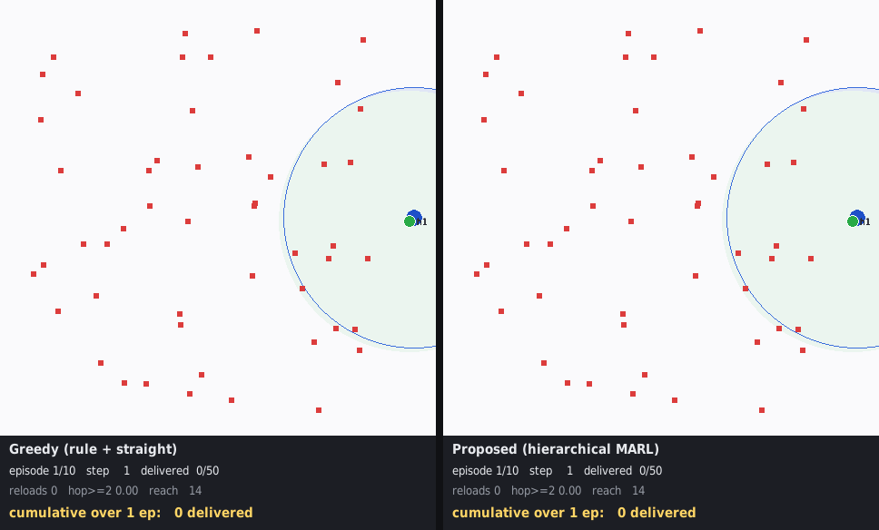

# Relay Drone Network — 재난 물자 배송을 위한 계층형 MARL

재난으로 통신 인프라가 파괴된 지역에서, 드론 편대가 물자를 배송하면서 동시에 서로의 통신을
중계하여 **모든 기체가 제어 센터와 항시 연결된 상태**를 유지하는 문제를 다룬다.
목적함수는 전 목적지 배송 완료 시간(makespan)의 최소화다.

- 프레임워크 설명: [`docs/framework_v3_26_08_31_19.md`](docs/framework_v3_26_08_31_19.md)
- 버전 간 차이 이력: [`docs/VERSIONS.md`](docs/VERSIONS.md)
- 논문 초안: [`docs/tex/`](docs/tex/) (국문·영문)
- 문헌 검토: [`ref/marl-relay-drone-delivery.md`](ref/marl-relay-drone-delivery.md)

## 문제 설정

| 항목 | 값 |
|---|---|
| 드론 / 목적지 | 4대 / 50곳 |
| 지도 | 1000 × 1000 |
| 통신 반경 | 300 |
| 적재량 / 하역 시간 | 5 / 10 스텝 |
| 최대 속도 | 13.89 / 스텝 |
| 에피소드 상한 | 1000 스텝 |

통신 반경 300은 임의로 고른 값이 아니다. 난이도 스윕 결과 반경 400 이상에서는 탐욕 휴리스틱이
문제를 사실상 해결해 학습이 기여할 여지가 없고, 300에서 (a) 탐욕이 실패하기 시작하며
(b) 인스턴스마다 최적 중계 대수가 달라 고정 규칙이 원리적으로 최적일 수 없다.

## 구조

```
proposed_src/
  env/       재난 릴레이 드론 환경 (연결성 하드 제약, 지표 계측)
  model/     정책·가치 네트워크
  pipeline/  학습 루프, 베이스라인, 평가, 감시 스크립트
  util/      인스턴스 생성, 상태 요약, 시각화, 난이도 스윕
docs/        프레임워크 설명, 버전 이력, 실험 보고, 논문 초안
ref/         문헌 검토
figures/     그래프, 시뮬레이션 GIF, 평가 결과 CSV
runs/        학습 로그 (지표 CSV)
weights/     각 실행의 최적 정책
legacy/      더 이상 쓰지 않으나 보존하는 코드 (MILP 시도, v1 이전 원본)
```

파일명 접미는 `버전넘버_YY_MM_DD_HH` 형식이다.

## 실행

```bash
# 계층 학습 — 1단계: 상위를 규칙으로 고정하고 하위(추력)만 학습
python3 proposed_src/pipeline/train_v3_26_08_31_19.py \
    --tag v3_w --stage worker --comm-range 300 --no-cluster-penalty

# 2단계: 하위를 고정하고 상위(이산 할당)만 학습
python3 proposed_src/pipeline/train_v3_26_08_31_19.py \
    --tag v3_m --stage manager --comm-range 300 --no-cluster-penalty \
    --worker-ckpt weights/v3_26_08_31_19_w_nocl/best_worker.pth

# 베이스라인 대비 평가 (홀드아웃 30 인스턴스 × 3회)
python3 proposed_src/pipeline/eval_v3_26_08_31_19.py --n 30 --reps 3 --no-cluster-penalty \
    --worker weights/v3_26_08_31_19_m_hl20/best_worker.pth \
    --manager weights/v3_26_08_31_19_m_hl20/best_manager.pth

# 학습 상태 요약
python3 proposed_src/util/status_v2_26_08_25_14.py

# 시각화 (탐욕 대 제안, 좌우 비교 GIF)
python3 proposed_src/util/compare_viz_v2_26_08_25_14.py --seed 101
```

크래시 시 자동 재개가 필요하면 `proposed_src/pipeline/supervise_v3_26_08_31_19.sh`로 감싼다.

## 현재 결과

홀드아웃 60 인스턴스 × 2회(롤아웃 120개), 통신 반경 300.
평가 조건은 **여유 예산**(무배송 4000스텝 컷, 상한 30000)에 **확률 샘플링 추론**이다.
목적이 makespan 최소화와 전량 완주이므로, 그 목적에 가장 가까운 조건을 정본으로 삼는다.

| 방법 | 배송 | 표준오차 | 재적재 | 최대 도달 | 완주 | makespan |
|---|---|---|---|---|---|---|
| 탐욕 | 22.68 | 0.78 | 1.99 | 646 | 0 | — |
| 탐욕 + 중계 1대 고정 | 14.57 | 0.56 | 1.08 | 533 | 0 | — |
| **제안 (계층, 시드1)** | **42.40** | 0.33 | 6.82 | **1006** | **4건 (3.3%)** | **8,146 ± 2,107** |
| 제안 (계층, 시드2) | 42.31 | 0.33 | 6.47 | 994 | 1건 (0.8%) | 10,980 |

**탐욕 대비 +87%** (23시그마). 최대 도달 거리 1006은 통신 반경의 **3.35배**로,
4대가 3홉 중계 체인을 실제로 구성한다는 뜻이다. 통신 단절은 학습·평가 전 구간 0건이다.

**추론 방식이 결정적이다.** 같은 가중치로 argmax 추론을 쓰면 배송이 31.17로 떨어지고
완주는 0건이 된다. 20 롤아웃 진단에서 argmax는 **16/20이 교착으로 종료**된 반면
샘플링은 **0/20**이었다. argmax는 교착 상태에서 같은 관측에 같은 행동을 반환해
스스로 빠져나올 수 없다. 연결성이 하드 제약인 다중 에이전트 문제에서
정책 엔트로피를 추론 시점에 남기는 것이 교착 탈출 경로가 된다.

**동시 학습은 해롭다**(21.43, 탐욕보다도 낮음). 하위 정책이 갱신되면 상위가 고른 목표의
의미가 바뀌어 상위 관점에서 환경이 비정상이 되기 때문으로 보인다.
최종 구성은 단계적 학습(하위 → 상위)에서 멈춘다.

자세한 절제 결과와 회귀 규명 과정은 [`docs/VERSIONS.md`](docs/VERSIONS.md)를 참조한다.



## 저장소에 포함하지 않은 것

- 에피소드별 체크포인트 약 3,300개(1GB) — 각 실행의 `best_*.pth`와 논문에 인용된
  v1 체크포인트 2개만 포함한다
- TensorBoard 이벤트 파일(187MB) — 동일 지표가 `runs/<tag>/metrics_<tag>.csv`에 있다

## 환경

Python 3.10, PyTorch 2.10 (CUDA 12.8), NumPy, Matplotlib, pygame, TensorBoard.
MILP 레거시 코드는 gurobipy가 필요하다.
