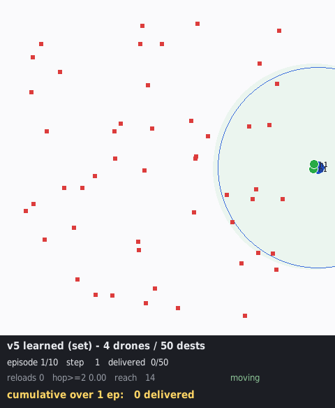

# Relay Drone Network — 재난 물자 배송을 위한 계층형 MARL

재난으로 통신 인프라가 파괴된 지역에서, 드론 편대가 물자를 배송하면서 동시에 서로의 통신을
중계하여 **모든 기체가 제어 센터와 항시 연결된 상태**를 유지하는 문제를 다룬다.
목적함수는 전 목적지 배송 완료 시간(makespan)의 최소화다.

- 프레임워크 설명: [`docs/framework_v3_26_08_31_19.md`](docs/framework_v3_26_08_31_19.md)
- 버전 간 차이 이력: [`docs/VERSIONS.md`](docs/VERSIONS.md)
- 논문 초안: [`docs/tex/`](docs/tex/) (국문·영문)
- 문헌 검토: [`ref/marl-relay-drone-delivery.md`](ref/marl-relay-drone-delivery.md)

## 문제 설정

| 항목 | 값 |
|---|---|
| 드론 / 목적지 | 4대 / 50곳 기본 — 학습·평가는 3-8대 / 20-80곳 |
| 지도 | 1000 × 1000 |
| 통신 반경 | 300 |
| 적재량 / 하역 시간 | 5 / 10 스텝 |
| 최대 속도 | 13.89 / 스텝 |
| 에피소드 상한 | 학습 1,000 / 평가 10,000 스텝 |

통신 반경 300은 임의로 고른 값이 아니다. 난이도 스윕 결과 반경 400 이상에서는 탐욕 휴리스틱이
문제를 사실상 해결해 학습이 기여할 여지가 없고, 300에서 (a) 탐욕이 실패하기 시작하며
(b) 인스턴스마다 최적 중계 대수가 달라 고정 규칙이 원리적으로 최적일 수 없다.

## 구조

```
proposed_src/
  env/       재난 릴레이 드론 환경 (연결성 하드 제약, 지표 계측)
  model/     정책·가치 네트워크
  pipeline/  학습 루프, 베이스라인, 평가, 감시 스크립트
  util/      인스턴스 생성, 상태 요약, 시각화, 난이도 스윕
docs/        프레임워크 설명, 버전 이력, 실험 보고, 논문 초안
ref/         문헌 검토
figures/     그래프, 시뮬레이션 GIF, 평가 결과 CSV
runs/        학습 로그 (지표 CSV)
weights/     각 실행의 최적 정책
legacy/      더 이상 쓰지 않으나 보존하는 코드 (MILP 시도, v1 이전 원본)
```

파일명 접미는 `버전넘버_YY_MM_DD_HH` 형식이다.

## 실행

```bash
# 3단계 학습 — 집합 상위, 구성 무작위 (드론 3-8, 목적지 20-80, CC 무작위)
python3 proposed_src/pipeline/train_v5_26_09_15_23.py --tag v5_s3 --random-config --seed 1

# 평가 — 학습에서 본 적 없는 구성으로 (예: 드론 5, 목적지 50, CC 무작위)
python3 proposed_src/pipeline/eval_v5_26_09_15_23.py --n 40 --no-cluster-penalty --stochastic \
    --straight-worker --max-steps 10000 --no-progress-limit 1000000000 --deadlock-limit 1000000000 \
    --num-drones 5 --num-dests 50 --random-cc --manager weights/v5_26_09_15_23_s3b/best_manager.pth

# 시각화 (10 에피소드 GIF)
python3 proposed_src/util/viz_single_v5_26_09_16_10.py --policy learned --arch set --straight \
    --manager weights/v5_26_09_15_23_s3b/best_manager.pth --episodes 10
```

## 현재 결과 (v5)

집합 기반 상위 정책 + 직진 하위 제어. 드론 3-8대·목적지 20-80곳·제어 센터 위치를 무작위로
섞어 한 번 학습한 가중치를, **추가 학습 없이** 네 구성에서 평가했다(여유 예산, 샘플링 추론).
값은 완주율 / 완주 시 makespan.

| 방법 | 4/50 고정CC (120롤) | 3/30 CC무작위 | 5/50 CC무작위 | 6/80 CC무작위 |
|---|---|---|---|---|
| 탐욕 | 0% / — | 0% / — | 30% / 557 | 50% / 619 |
| 기하 중계 규칙 (학습 없음) | 65.8% / 827 | 95.0% / 580 | 90.0% / 584 | 97.5% / 803 |
| **제안 (v5, 시드 2개)** | **100% · 100%** / 1,356-1,544 | **100% · 100%** / 1,194-1,307 | **100% · 100%** / 828-868 | **100% · 100%** / 901-923 |

**네 구성 240 인스턴스 전부 완주.** 배송 수 표준편차 0.00. 최장 교착은 규칙의 3-70분의 1이다.
남은 격차는 makespan으로, 규칙은 완주하는 경우 드론이 빠듯한 구성에서 약 2배, 넉넉한 구성에서
12-15% 빠르다.

드론 4대만 보고 배운 가중치도 3·5·6대에서 87.5-97.5% 완주한다 — 집합 구조가 구조 자체로
드론 수에 일반화하며, 구성 무작위화는 마지막 완주율과 속도를 더한다.

이력과 절제·규명 과정은 [`docs/VERSIONS.md`](docs/VERSIONS.md)를 참조한다.



## 저장소에 포함하지 않은 것

- 에피소드별 체크포인트 약 3,300개(1GB) — 각 실행의 `best_*.pth`와 논문에 인용된
  v1 체크포인트 2개만 포함한다
- TensorBoard 이벤트 파일(187MB) — 동일 지표가 `runs/<tag>/metrics_<tag>.csv`에 있다

## 환경

Python 3.10, PyTorch 2.10 (CUDA 12.8), NumPy, Matplotlib, pygame, TensorBoard.
MILP 레거시 코드는 gurobipy가 필요하다.
