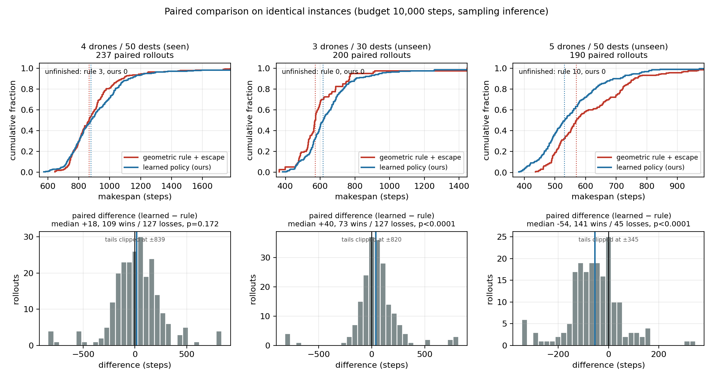
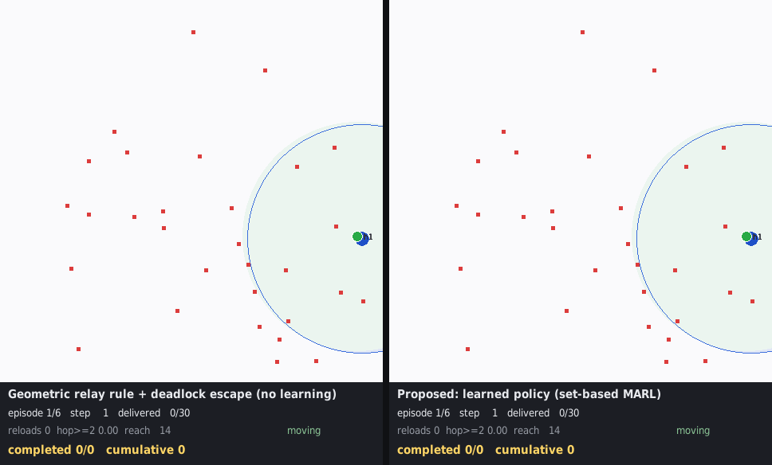

# Relay Drone Network — 재난 물자 배송을 위한 계층형 MARL

재난으로 통신 인프라가 파괴된 지역에서, 드론 편대가 물자를 배송하면서 동시에 서로의 통신을
중계하여 **모든 기체가 제어 센터와 항시 연결된 상태**를 유지하는 문제를 다룬다.
목적함수는 전 목적지 배송 완료 시간(makespan)의 최소화다.

- 프레임워크 설명: [`docs/framework_v3_26_08_31_19.md`](docs/framework_v3_26_08_31_19.md)
- 버전 간 차이 이력: [`docs/VERSIONS.md`](docs/VERSIONS.md)
- 논문 초안: [`docs/tex/`](docs/tex/) (국문·영문)
- 문헌 검토: [`ref/marl-relay-drone-delivery.md`](ref/marl-relay-drone-delivery.md)

## 문제 설정

| 항목 | 값 |
|---|---|
| 드론 / 목적지 | 4대 / 50곳 기본 — 학습은 3-4대 / 20-80곳, 평가는 3-5대 / 30-50곳 |
| 지도 | 1000 × 1000 |
| 통신 반경 | 300 |
| 적재량 / 하역 시간 | 5 / 10 스텝 |
| 최대 속도 | 13.89 / 스텝 |
| 에피소드 상한 | 학습 1,000 / 평가 10,000 스텝 |

통신 반경 300은 임의로 고른 값이 아니다. 난이도 스윕 결과 반경 400 이상에서는 탐욕 휴리스틱이
문제를 사실상 해결해 학습이 기여할 여지가 없고, 300에서 (a) 탐욕이 실패하기 시작하며
(b) 인스턴스마다 최적 중계 대수가 달라 고정 규칙이 원리적으로 최적일 수 없다.

## 구조

```
proposed_src/
  env/       재난 릴레이 드론 환경 (연결성 하드 제약, 지표 계측)
  model/     정책·가치 네트워크
  pipeline/  학습 루프, 베이스라인, 평가, 감시 스크립트
  util/      인스턴스 생성, 상태 요약, 시각화, 난이도 스윕
docs/        프레임워크 설명, 버전 이력, 실험 보고, 논문 초안
ref/         문헌 검토
figures/     그래프, 시뮬레이션 GIF, 평가 결과 CSV
runs/        학습 로그 (지표 CSV)
weights/     각 실행의 최적 정책
legacy/      더 이상 쓰지 않으나 보존하는 코드 (MILP 시도, v1 이전 원본)
```

파일명 접미는 `버전넘버_YY_MM_DD_HH` 형식이다.

## 실행

```bash
# 학습 — 자기회귀 집합 상위, 드론 3-4·목적지 20-80·CC 무작위, 엔트로피 목표 0.6->0.25 (400ep 감쇠)
python3 proposed_src/pipeline/train_v5_26_09_15_23.py --tag v5_d34 --random-config \
    --drones-range 3 4 --autoregressive --rule-reg 2.0 --residual-penalty 0.1 \
    --ent-frac 0.6 --ent-frac-final 0.25 --ent-anneal-episodes 400 \
    --select makespan --speed-weight 40 --holdout-steps 3000 --eval-n 80 --seed 1

# 평가 — 학습에서 본 적 없는 구성으로 (예: 드론 5, 목적지 50, CC 무작위)
python3 proposed_src/pipeline/eval_v5_26_09_15_23.py --n 40 --arch set --autoregressive \
    --no-cluster-penalty --stochastic --straight-worker --max-steps 10000 \
    --no-progress-limit 1000000000 --deadlock-limit 1000000000 \
    --num-drones 5 --num-dests 50 --random-cc --manager weights/v5_26_09_23_18_SWa/best_manager.pth

# MILP 참조 모형 (작은 인스턴스, Gurobi 필요. 수식은 docs/tex/milp_en_v5_26_09_21_03.pdf)
python3 proposed_src/pipeline/milp_v5_26_09_21_03.py --num-drones 3 --num-dests 6 \
    --kappa 10 --time-limit 1800 --norel 150

# 규칙과의 쌍별 비교 (같은 인스턴스, 중앙값·윌콕슨 검정)
python3 proposed_src/util/paired_v5_26_09_27_08.py --autoregressive --n 60 --reps 2 \
    --manager weights/v5_26_09_23_18_SWa/best_manager.pth

# 시각화 (10 에피소드 GIF)
python3 proposed_src/util/viz_single_v5_26_09_27_05.py --policy learned --arch set --straight \
    --autoregressive --manager weights/v5_26_09_23_18_SWa/best_manager.pth --episodes 10
```

## 현재 결과 (제안 가중치 `v5_26_09_23_18_SWa`, 26-09-27 대표본 재측정)

제안 방법은 **학습 단독**이다. 집합 기반 자기회귀 상위 정책이 20스텝마다 드론별 목표(배송지·복귀·중계
슬롯)를 배분하고, 하위는 직진 제어다. 드론 3-4대·목적지 20-80곳·CC 무작위로 한 번 학습한 가중치를
추가 학습 없이 모든 구성에 쓴다.

**비교는 쌍별로 한다.** 각 방법이 완주한 에피소드만 평균하면 어려운 인스턴스를 포기한 쪽이 유리해
보이고, 드문 장기 정체 한 건이 40개 평균을 110스텝 흔든다. 그래서 같은 인스턴스에서 규칙+탈출과
학습을 각각 굴려 짝을 만들고, 두 방법이 모두 완주한 짝에서 중앙값 차이와 윌콕슨 부호순위 검정을
본다. 표본은 구성마다 200롤아웃 이상이다(여유 예산 10,000스텝, 샘플링 추론).

| 구성 | 롤아웃 | 완주 (규칙 / 학습) | 중앙값 (규칙 / 학습) | 쌍별 차이 | 승-패 | p |
|---|---|---|---|---|---|---|
| 표준 4/50 | 240 | 237 / **240** | 866 / 879 | +18 | 109-127 | 0.17 |
| 미지 3/30 | 200 | 200 / 200 | **572** / 617 | +40 | 73-127 | **<0.0001** |
| 미지 5/50 | 200 | 190 / **200** | 570 / **532** | **−54** | 141-45 | **<0.0001** |

**얻는 것과 잃는 것이 구성에 따라 갈린다.** 드론이 넉넉한 5/50에서는 학습이 완주(200:200 대
190:200)와 속도(중앙값 −38, 쌍별 −54) 모두에서 이긴다. 표준 4/50은 makespan 동률이고 완주 3건이
학습의 이득이다. 드론이 셋뿐인 3/30에서는 규칙이 중앙값 45스텝 빠르고 이 열세는 유의하다.



**꼬리도 같은 방향으로 갈린다.**

| 구성 (롤아웃) | 규칙 표준편차 / 최댓값 | 학습 표준편차 / 최댓값 |
|---|---|---|
| 표준 4/50 (240) | 188 / 2,014 | 521 / 8,336 |
| 미지 3/30 (200) | 172 / 1,447 | 382 / 5,395 |
| 미지 5/50 (200) | 150 / 1,734 | 111 / 1,101 |



왼쪽이 규칙+탈출, 오른쪽이 제안이다. 보라 십자가 중계 슬롯, 보라 원이 중계 중인 드론이다.
규칙은 사슬을 먼저 세우고 선두가 나아가며, 제안은 중계를 덜 세운 채 배송 드론을 더 내보낸다.

드론이 부족하면 학습 정책이 규칙보다 무거운 꼬리를 갖고, 넉넉하면 더 가볍다. 원인은 중계 부족이다.
3/30에서 학습은 중계를 평균 0.78대만 세우고(규칙 1.39) 연결성 투영에 막힌 드론-스텝이 1,289 대
160이다. 중계 배정만 규칙으로 덮으면 막힘이 60% 줄고 쌍별 중앙값 54스텝이 회복된다(p=0.053).
이 크레딧 할당을 학습으로 고치는 것이 현재 진행 중인 사이클 13이다.

베이스라인 주석: 원래 기하 중계 규칙은 결정론적이라 교착에서 빠져나오지 못해 완주가 66-95%에
그친다. 정체 60스텝마다 선두를 교대하는 탈출 규칙을 더해 완주 95-100%로 끌어올린 것이 정직한
비교 대상이며, 위 표의 규칙이 그것이다.

추론 속도: 상위 결정 1회가 드론 4대에서 1.52 ms(자기회귀 없음) 또는 3.52 ms(자기회귀)다. 900스텝
에피소드의 누적 상위 시간은 0.069초와 0.158초다. 같은 규모를 MILP로 풀면 600-1,200초가 걸린다.

무엇이 통했는가: **SAC의 엔트로피 목표가 이 문제의 성능 상한을 정하고 있었다.** 관행적으로 둔
0.6·log n은 정책을 흐트러뜨려 여러 스텝의 일관된 계획을 막는 동시에 교착 탈출의 유일한 원천이었다.
0.6에서 0.25로 400 에피소드에 걸쳐 낮추자 표준 makespan이 1,418 → 900대로 내려갔다. 여기에
체크포인트 선택 점수에서 속도 항의 가중치를 올려(완주 1%p ↔ 75스텝) 빠른 정책이 완주 한두 건 때문에
버려지지 않게 한 것이 마지막 조각이었다.

## 절제 연구 (v5.5)

제안 구성에서 한 요소씩 빼고 시드 2개씩 다시 학습해 세 구성에서 평가했다. 값은 완주율 / makespan
(두 시드 평균, 괄호는 기준 대비). 기준 행을 빼면 굵은 차이만 유의 문턱 70-80스텝을 넘는다.

| 제거한 요소 | 표준 4/50 | 3/30 | 5/50 |
|---|---|---|---|
| **없음 (제안)** | **120/120 · 927** | **40/40 · 755** | **40/40 · 574** |
| 잔여 페널티 | 120/120 · 899 (−28) | 40/40 · 718 (−37) | 40/40 · 582 (+8) |
| 자기회귀 | 120/120 · 1,022 (**+94**) | 40/40 · 710 (−46) | 40/40 · 607 (+33) |
| 엔트로피 감쇠 | 120/120 · 1,056 (**+128**) | 40/40 · 774 (+19) | 40/40 · 635 (+61) |
| 구성 무작위화 | 120/120 · 883 (−44) | 40/40 · 1,402 (**+646**) | 40/40 · 642 (+68) |
| 규칙 정규화 | 118/120 · 1,246 (**+320**) | 39/40 · 1,163 (**+408**) | 40/40 · 666 (**+92**) |

**규칙 정규화가 가장 중요하다** — 빼면 세 구성 모두 나빠지고 완주도 잃는다. **구성 무작위화는
일반화의 값을 정확히 보여준다** — 학습 분포와 같은 표준 구성에서는 빼는 쪽이 44스텝 빠르지만,
보지 않은 드론 3대 구성에서 646스텝(86%) 느려진다. **엔트로피 감쇠**는 표준·5/50에서 확실히
기여한다. **자기회귀는 표준에서 94스텝 유리하고 추론이 드론 4대에서 2.3배, 8대에서 3.0배 느리다.**

**유의 문턱 (26-09-27 정정).** 같은 구성을 네 번 독립 학습하면 표준 makespan이 919-979로 흩어진다
(폭 100스텝). 따라서 시드 2개 평균의 차이는 70-80스텝을 넘을 때만 의미가 있다. 위 표에서 이를
넘는 것은 규칙 정규화(세 구성 모두), 구성 무작위화의 3/30, 엔트로피 감쇠의 표준, 자기회귀의
표준뿐이다(5/50의 +92는 문턱 위쪽 경계에 있다). **잔여 페널티 제거는 중립이며**, 앞서 "해롭다"고 쓴 것은 실행 간 변동을 효과로
착각한 것이다.

드론이 넉넉한 5/50은 요소 제거에 둔감하고(차이 8~92스텝) 드론 3대 구성이 가장 민감하다(최대 646).
절제된 정책조차 5/50에서는 규칙+탈출을 완주와 속도 모두에서 앞선다.

작은 인스턴스에서는 시공간 격자 MILP 참조 모형과도 비교한다(드론 3·목적지 4-6에서 최적 계획을
찾아 시뮬레이터로 재생 검증). 모형과 수식은 [`docs/tex/milp_en_v5_26_09_21_03.pdf`](docs/tex/milp_en_v5_26_09_21_03.pdf)에 있다.

이력과 규명 과정은 [`docs/VERSIONS.md`](docs/VERSIONS.md)를 참조한다.

## 저장소에 포함하지 않은 것

- 에피소드별 체크포인트 약 3,300개(1GB) — 각 실행의 `best_*.pth`와 논문에 인용된
  v1 체크포인트 2개만 포함한다
- TensorBoard 이벤트 파일(187MB) — 동일 지표가 `runs/<tag>/metrics_<tag>.csv`에 있다

## 환경

Python 3.10, PyTorch 2.10 (CUDA 12.8), NumPy, Matplotlib, pygame, TensorBoard.
MILP 레거시 코드는 gurobipy가 필요하다.
